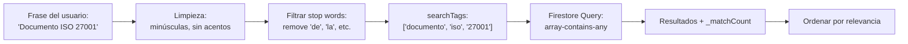

# 📖 Guía de Implementación — API de Búsqueda de Documentos

## Índice

1. [Endpoint y Uso Básico](#1-endpoint-y-uso-básico)
2. [Estructura de la Respuesta JSON](#2-estructura-de-la-respuesta-json)
3. [Campos del Documento](#3-campos-del-documento)
4. [Metadata Universal vs. Específica](#4-metadata-universal-vs-específica)
5. [Variaciones por Categoría de Archivo](#5-variaciones-por-categoría-de-archivo)
6. [El Sistema de Tags y Relevancia](#6-el-sistema-de-tags-y-relevancia)
7. [Campos que Pueden Ser Nulos](#7-campos-que-pueden-ser-nulos)
8. [Ejemplos de Integración](#8-ejemplos-de-integración)
9. [Manejo de Errores](#9-manejo-de-errores)

---

## 1. Endpoint y Uso Básico

```
GET /api/documents/search?q={frase de búsqueda}
```

- **Método:** `GET`
- **Parámetro requerido:** `q` — la frase de búsqueda en lenguaje natural
- **Puerto por defecto:** `3000`

### Ejemplo de petición

```bash
# cURL
curl "http://localhost:3000/api/documents/search?q=Documento%20iso%2027001"
```

```javascript
// JavaScript (fetch)
const response = await fetch('http://localhost:3000/api/documents/search?q=' + encodeURIComponent('Documento iso 27001'));
const result = await response.json();
```

> [!IMPORTANT]
> Siempre usa `encodeURIComponent()` para codificar la frase de búsqueda, ya que puede contener espacios, acentos y caracteres especiales.

---

## 2. Estructura de la Respuesta JSON

La API siempre retorna un JSON con esta estructura base:

```json
{
  "status": "success",
  "data": [ ...documentos... ],
  "searchTags": [ "documento", "iso", "27001" ]
}
```

| Campo | Tipo | Descripción |
|-------|------|-------------|
| `status` | `string` | `"success"` o `"error"` |
| `data` | `array` | Array de documentos encontrados, ordenados por relevancia |
| `searchTags` | `string[]` | Las palabras clave que la API extrajo de tu frase (sin stop words) |
| `message` | `string` | *(Opcional)* Aparece cuando no hay palabras clave válidas o en errores |

> [!NOTE]
> `searchTags` muestra exactamente qué palabras se usaron para buscar. La API elimina automáticamente los "stop words" (artículos, preposiciones, pronombres) y remueve acentos. Por ejemplo, `"Documento de la ISO 27001"` → `["documento", "iso", "27001"]`.

---

## 3. Campos del Documento

Cada elemento en `data[]` representa un documento almacenado en Firebase:

```json
{
  "id": "FBE20C1D-C795-4684-8EA9-53CDE0628FFE",
  "title": "Documento de prueba ISO 27001",
  "description": "Manual de seguridad de la información para la planta industrial",
  "filePath": "/uploads/document.docx",
  "authorId": 101,
  "authorName": "Juan Pérez",
  "statusId": 3,
  "companyId": 1,
  "companyName": "Google LLC",
  "parentId": null,
  "versionNumber": 1,
  "isLatest": true,
  "syncedAt": "2026-05-02T22:25:40.947Z",
  "metadata": { ... },
  "_matchCount": 3
}
```

### Tabla de campos del documento

| Campo | Tipo | ¿Siempre presente? | Descripción |
|-------|------|:---:|-------------|
| `id` | `string` | ✅ | UUID único del documento |
| `title` | `string` | ✅ | Título del documento |
| `description` | `string` | ✅ | Descripción (puede estar vacía `""`) |
| `filePath` | `string \| null` | ⚠️ | Ruta del archivo en el servidor |
| `authorId` | `number \| null` | ⚠️ | ID del autor en tu sistema |
| `authorName` | `string \| null` | ⚠️ | Nombre del autor (si fue enviado al sincronizar) |
| `statusId` | `number \| null` | ⚠️ | ID del estado del documento |
| `companyId` | `number \| null` | ⚠️ | ID de la empresa |
| `companyName` | `string \| null` | ⚠️ | Nombre de la empresa (si fue enviado) |
| `parentId` | `number \| null` | ⚠️ | ID del documento padre (para versiones) |
| `versionNumber` | `number` | ✅ | Número de versión (por defecto `1`) |
| `isLatest` | `boolean` | ✅ | Si es la versión más reciente |
| `syncedAt` | `string` | ✅ | Fecha ISO 8601 de sincronización con Firebase |
| `metadata` | `object` | ✅ | Objeto con toda la metadata del archivo |
| `_matchCount` | `number` | ✅ | Cantidad de tags que coincidieron con la búsqueda |

> [!WARNING]
> Los campos marcados con ⚠️ pueden ser `null` si no fueron proporcionados al sincronizar el documento. **Siempre valida antes de usar:** `doc.authorName ?? '(desconocido)'`.

> [!IMPORTANT]
> **Los campos se envían en camelCase con primera letra minúscula** (`title`, `description`, `filePath`, etc.). Si vienes de una API .NET donde se usaba PascalCase (`Title`, `Description`), ten cuidado con este cambio.

---

## 4. Metadata Universal vs. Específica

La metadata tiene **dos niveles**:

```
metadata
├── fileSize          ─┐
├── mimeType           │
├── extension          │  Nivel 1: UNIVERSAL
├── checksum           │  (siempre presente, igual para todos los tipos)
├── sha256             │
├── createdOnDisk      │
├── modifiedOnDisk    ─┘
├── category          → Define qué campos tiene "specific"
├── specific          → Nivel 2: ESPECÍFICA (varía por categoría)
└── tags              → Array de tags generados por IA
```

### Metadata Universal (Nivel 1)

| Campo | Tipo | Descripción |
|-------|------|-------------|
| `fileSize` | `string` | Tamaño formateado (`"2.90MB"`, `"150KB"`) |
| `mimeType` | `string` | Tipo MIME (`"application/pdf"`, `"image/jpeg"`) |
| `extension` | `string` | Extensión con punto (`".docx"`, `".pdf"`, `".jpg"`) |
| `checksum` | `string` | Hash MD5 del archivo |
| `sha256` | `string` | Hash SHA-256 del archivo |
| `createdOnDisk` | `string` | Fecha de creación en disco (ISO 8601) |
| `modifiedOnDisk` | `string` | Fecha de última modificación en disco (ISO 8601) |
| `category` | `string` | Categoría del archivo: `"document"`, `"image"`, `"cad"`, u otra |
| `tags` | `string[]` | Tags generados por IA + tags previos, normalizados |

---

## 5. Variaciones por Categoría de Archivo

### 📄 `category: "document"` — Documentos de oficina

Aplica a: `.docx`, `.pdf`, `.xlsx`, `.pptx`, `.txt`, etc.

```json
"specific": {
  "authorOriginal": "Juan Pérez" | null,
  "pageCount": 45 | null,
  "hasImages": true | false,
  "language": "es" | null
}
```

| Campo | Tipo | Descripción |
|-------|------|-------------|
| `authorOriginal` | `string \| null` | Autor embebido en los metadatos del archivo |
| `pageCount` | `number \| null` | Cantidad de páginas (si aplica) |
| `hasImages` | `boolean` | Si el documento contiene imágenes |
| `language` | `string \| null` | Idioma detectado del contenido |

> [!NOTE]
> `authorOriginal` es el autor que viene **dentro del archivo** (metadato del .docx/.pdf), no es el `authorName` del payload que es el autor en tu sistema.

---

### 🖼️ `category: "image"` — Imágenes

Aplica a: `.jpg`, `.jpeg`, `.png`, `.gif`, `.bmp`, `.tiff`, `.webp`, etc.

```json
"specific": {
  "dimensions": "1920x1080",
  "width": 1920,
  "height": 1080,
  "colorSpace": "sRGB",
  "exifData": {
    "make": "Canon",
    "model": "EOS R5",
    "dateTaken": "2026-04-15T14:30:00Z",
    "gps": {
      "lat": 19.4326,
      "lng": -99.1332
    },
    "orientation": 1
  }
}
```

| Campo | Tipo | Descripción |
|-------|------|-------------|
| `dimensions` | `string \| null` | Dimensiones formateadas (`"1920x1080"`) |
| `width` | `number \| null` | Ancho en píxeles |
| `height` | `number \| null` | Alto en píxeles |
| `colorSpace` | `string \| null` | Espacio de color (`"sRGB"`, `"Adobe RGB"`) |
| `exifData` | `object \| undefined` | Datos EXIF (solo si la imagen los contiene) |
| `exifData.make` | `string` | Fabricante de la cámara |
| `exifData.model` | `string` | Modelo de la cámara |
| `exifData.dateTaken` | `string` | Fecha de captura (ISO 8601) |
| `exifData.gps` | `object \| undefined` | Coordenadas GPS (si están embebidas) |
| `exifData.gps.lat` | `number \| null` | Latitud |
| `exifData.gps.lng` | `number \| null` | Longitud |
| `exifData.orientation` | `number` | Orientación EXIF (1-8) |

> [!TIP]
> No todas las imágenes tienen datos EXIF. Los PNG generalmente no los tienen, y las fotos con GPS limpiado tampoco. Siempre valida: `if (meta.specific.exifData?.gps) { ... }`.

---

### 📐 `category: "cad"` — Archivos de diseño técnico

Aplica a: `.dwg`, `.dxf`, `.step`, `.iges`, etc.

```json
"specific": {
  "softwareVersion": "AutoCAD 2024",
  "layers": ["Planta", "Eléctrico", "Mecánico", "Cotas"]
}
```

| Campo | Tipo | Descripción |
|-------|------|-------------|
| `softwareVersion` | `string \| null` | Versión del software con el que se creó |
| `layers` | `string[]` | Lista de capas/layers del diseño |

---

### ❓ Otras categorías (`"other"`, `"video"`, `"audio"`, etc.)

Si la categoría no es `document`, `image`, ni `cad`, el campo `specific` se guarda tal cual sin validación estricta. Podrías recibir cualquier estructura de campos.

```javascript
// Estrategia segura para categorías desconocidas:
if (meta.specific) {
  Object.entries(meta.specific).forEach(([key, value]) => {
    console.log(`${key}: ${JSON.stringify(value)}`);
  });
}
```

---

## 6. El Sistema de Tags y Relevancia

### ¿Cómo funciona la búsqueda?



1. La frase de búsqueda se limpia (minúsculas, sin acentos, sin puntuación)
2. Se eliminan los stop words (artículos, preposiciones, pronombres en español)
3. Se buscan documentos cuyo `metadata.tags` contenga **al menos una** de las palabras
4. Cada resultado incluye `_matchCount`: cantidad de tags que coincidieron
5. Los resultados se ordenan de mayor a menor `_matchCount`

### ¿Cómo interpretar `_matchCount`?

| `_matchCount` | Significado |
|:-:|---|
| = total de `searchTags` | **Coincidencia perfecta** — El documento contiene todas las palabras buscadas |
| > 50% de `searchTags` | **Alta relevancia** — Muy probable que sea lo que se busca |
| = 1 | **Baja relevancia** — Solo una palabra coincide |

```javascript
// Ejemplo: clasificar relevancia en el frontend
const totalSearchTags = result.searchTags.length;

result.data.forEach(doc => {
  const ratio = doc._matchCount / totalSearchTags;
  let relevancia;
  
  if (ratio === 1)       relevancia = '🟢 Exacta';
  else if (ratio >= 0.5) relevancia = '🟡 Alta';
  else                   relevancia = '🔴 Baja';
  
  console.log(`${doc.title} — ${relevancia} (${doc._matchCount}/${totalSearchTags})`);
});
```

> [!TIP]
> Firestore limita `array-contains-any` a **máximo 10 elementos**. Si el usuario escribe una frase muy larga, solo se usan las primeras 10 palabras clave.

---

## 7. Campos que Pueden Ser Nulos

Esta tabla resume qué campos pueden llegar como `null`, `undefined`, o vacío (`""`):

| Campo | Puede ser `null` | Puede ser `undefined` | Puede ser `""` |
|-------|:-:|:-:|:-:|
| `doc.description` | ❌ | ❌ | ✅ |
| `doc.filePath` | ✅ | ❌ | ❌ |
| `doc.authorId` | ✅ | ❌ | ❌ |
| `doc.authorName` | ✅ | ✅ | ❌ |
| `doc.companyName` | ✅ | ✅ | ❌ |
| `doc.parentId` | ✅ | ❌ | ❌ |
| `specific.authorOriginal` | ✅ | ✅ | ❌ |
| `specific.pageCount` | ✅ | ✅ | ❌ |
| `specific.language` | ✅ | ✅ | ❌ |
| `specific.exifData` | ❌ | ✅ | ❌ |
| `specific.exifData.gps` | ❌ | ✅ | ❌ |

> [!CAUTION]
> Campos como `authorName` y `companyName` solo están presentes si fueron enviados en el payload original de sincronización. **No confíes en que siempre existen.** Usa operadores de encadenamiento opcional (`?.`) y nullish coalescing (`??`).

---

## 8. Ejemplos de Integración

### JavaScript / React — Ejemplo completo

```javascript
async function buscarDocumentos(frase) {
  try {
    const url = `http://localhost:3000/api/documents/search?q=${encodeURIComponent(frase)}`;
    const response = await fetch(url);
    
    if (!response.ok) {
      const errorData = await response.json();
      throw new Error(errorData.message || `Error HTTP ${response.status}`);
    }
    
    const result = await response.json();
    
    return {
      searchTags: result.searchTags || [],
      documents: (result.data || []).map(doc => ({
        // Datos principales
        id: doc.id,
        title: doc.title,
        description: doc.description || '',
        filePath: doc.filePath,
        
        // Autor y empresa
        authorId: doc.authorId,
        authorName: doc.authorName ?? null,
        companyId: doc.companyId,
        companyName: doc.companyName ?? null,
        
        // Versionado
        versionNumber: doc.versionNumber,
        isLatest: doc.isLatest,
        
        // Metadata del archivo
        fileSize: doc.metadata?.fileSize ?? 'Desconocido',
        mimeType: doc.metadata?.mimeType ?? 'Desconocido',
        extension: doc.metadata?.extension ?? '',
        category: doc.metadata?.category ?? 'other',
        
        // Metadata específica (varía por categoría)
        specificMeta: doc.metadata?.specific ?? {},
        
        // Tags y relevancia
        tags: doc.metadata?.tags ?? [],
        matchCount: doc._matchCount,
        
        // Fechas
        syncedAt: doc.syncedAt,
        createdOnDisk: doc.metadata?.createdOnDisk,
        modifiedOnDisk: doc.metadata?.modifiedOnDisk,
      })),
    };
  } catch (error) {
    console.error('Error en búsqueda:', error.message);
    throw error;
  }
}

// Uso:
const resultado = await buscarDocumentos('manual seguridad informática');
resultado.documents.forEach(doc => {
  console.log(`[${doc.matchCount} matches] ${doc.title} (${doc.extension})`);
  
  // Renderizar metadata específica según categoría
  switch (doc.category) {
    case 'document':
      console.log(`  Páginas: ${doc.specificMeta.pageCount ?? 'N/A'}`);
      break;
    case 'image':
      console.log(`  Dimensiones: ${doc.specificMeta.dimensions ?? 'N/A'}`);
      break;
    case 'cad':
      console.log(`  Capas: ${doc.specificMeta.layers?.join(', ') ?? 'N/A'}`);
      break;
  }
});
```

### C# / .NET — Ejemplo con HttpClient

```csharp
public class SearchResult
{
    public string Status { get; set; }
    public List<DocumentResult> Data { get; set; }
    public List<string> SearchTags { get; set; }
}

public class DocumentResult
{
    public string Id { get; set; }
    public string Title { get; set; }
    public string Description { get; set; }
    public string FilePath { get; set; }
    public int? AuthorId { get; set; }
    public string AuthorName { get; set; }
    public int? StatusId { get; set; }
    public int? CompanyId { get; set; }
    public string CompanyName { get; set; }
    public int VersionNumber { get; set; }
    public bool IsLatest { get; set; }
    public string SyncedAt { get; set; }
    public DocumentMetadata Metadata { get; set; }
    
    [JsonPropertyName("_matchCount")]
    public int MatchCount { get; set; }
}

public class DocumentMetadata
{
    public string FileSize { get; set; }
    public string MimeType { get; set; }
    public string Extension { get; set; }
    public string Checksum { get; set; }
    public string Sha256 { get; set; }
    public string CreatedOnDisk { get; set; }
    public string ModifiedOnDisk { get; set; }
    public string Category { get; set; }
    public JsonElement? Specific { get; set; }  // Dinámico
    public List<string> Tags { get; set; }
}

// Uso:
var query = Uri.EscapeDataString("manual iso 27001");
var response = await httpClient.GetFromJsonAsync<SearchResult>(
    $"http://localhost:3000/api/documents/search?q={query}"
);
```

> [!NOTE]
> En C#, el campo `specific` se modela como `JsonElement?` porque su estructura cambia según la categoría. Usa `JsonElement.GetProperty()` para acceder a campos dinámicamente, o crea clases separadas por categoría y deserializa condicionalmente.

---

## 9. Manejo de Errores

### Códigos de respuesta HTTP

| Código | Causa | Campo `message` |
|--------|-------|-----------------|
| `200` | Búsqueda exitosa (puede tener 0 resultados) | — |
| `200` | Solo stop words enviados (sin palabras clave válidas) | `"La búsqueda no contiene palabras clave válidas."` |
| `400` | No se envió el parámetro `q` | `"Se requiere el parámetro de búsqueda \"q\"."` |
| `500` | Error interno (Firebase, timeout, etc.) | `"Error al realizar la búsqueda en Firestore"` |

### Ejemplo de manejo robusto

```javascript
const response = await fetch(url);
const result = await response.json();

if (!response.ok) {
  // HTTP 400 o 500
  console.error(`Error ${response.status}: ${result.message}`);
  if (result.error) console.error(`Detalle: ${result.error}`);
  return;
}

if (result.status === 'success' && result.data?.length === 0) {
  // Búsqueda exitosa pero sin resultados
  console.log('No se encontraron documentos.');
  console.log('Tags buscados:', result.searchTags?.join(', ') || '(ninguno válido)');
  return;
}

// Resultados encontrados
result.data.forEach(doc => { /* ... */ });
```

> [!TIP]
> Si recibes `data: []` con `searchTags` presentes, significa que ningún documento en Firebase tiene esos tags. Si `data: []` viene con el mensaje de "palabras clave no válidas", el usuario probablemente solo escribió artículos o preposiciones.
